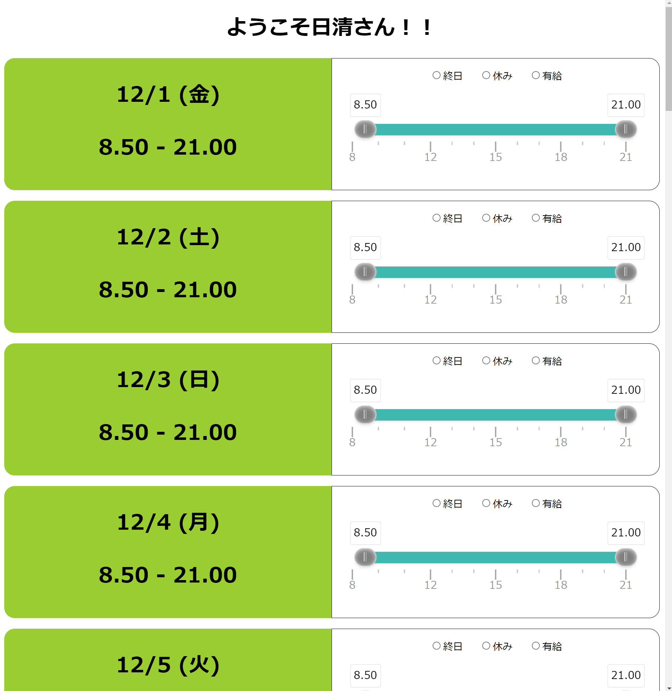
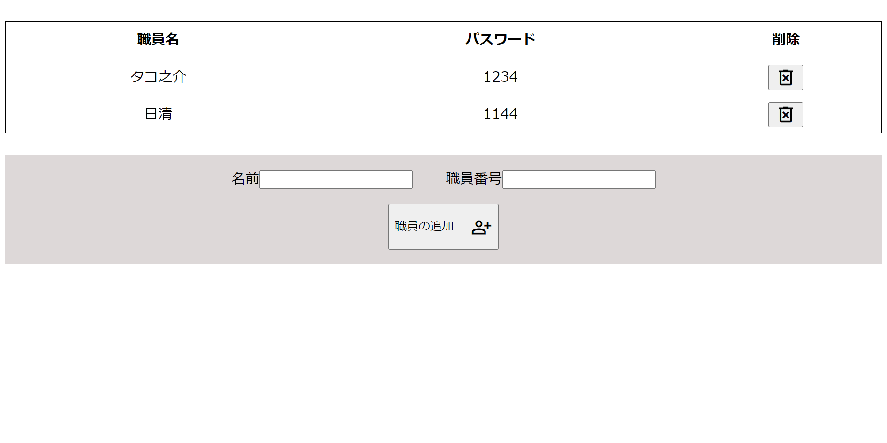

## サービス名

希望シフト調整ソフト

## サービスの特徴

現職では、シフト管理をGoogleフォームとExcelを用いて行っています。

しかし、Googleフォームではシフト管理が直感的ではなく、入力に時間がかかるというデメリットがありました。
このプロダクトは、Googleフォームに代わるシフト管理アプリを作成して、より快適にシフト入力してもらいたいという考えから作成しました。

現在は希望シフトの提出のみですが、シフト自動調整ができるアプリの実現を目指しています。

## サービスへのアクセス

1. Node.js をパソコンにインストールする。
2. `npn instll`でライブラリをダウンロードする。
3. `npm run dev`でローカルホストを起動。
4. [http://localhost:5173/main-form/index.html]で`main-form`にアクセスする。

## 機能一覧

| トップ画面                                             | ログイン画面                                                     |
| ------------------------------------------------------ | ---------------------------------------------------------------- |
|               |                |
| 名前と職員番号での突き合わせを実装したログインフォーム | スライダーを用いた直感的な時間指定とワンクリックで選択できる時間 |
|         |                  |
| 職員の名前と職員番号を登録・削除する                   | 全体の希望シフトが一目でわかる表で表示、Excelデータの出力        |

## 使用技術

| カテゴリー | 使用技術                                       |
| ---------- | ---------------------------------------------- |
| main-form  | typescript, vite, HTML, Sass                   |
| input-form | typescript, vite, HTML, Sass, noUiSlider       |
| user-edit  | typescript, vite, HTML, Sass                   |
| user-edit  | typescript, vite, HTML, Sass, file-saver, xlsx |
| etc.       | prettier, eslint, Git, Github, node.js         |

## 今後のアップグレード

- ソフト内で完結する月ごとのシフト管理表 
  現在はプログラムにある数値を操作して、月を変化してるので、アプリ内で完結するようにする。
- カスタム時間指定の作成 
  現在は終日・休日・有給しか選べませんが、個人がよく使う時間を指定して、すぐにシフトに表示できるようにする。
- デザイン性の向上 
  デザインをより、ユーザーインターフェースを意識した、扱いやすいデザインにする。
